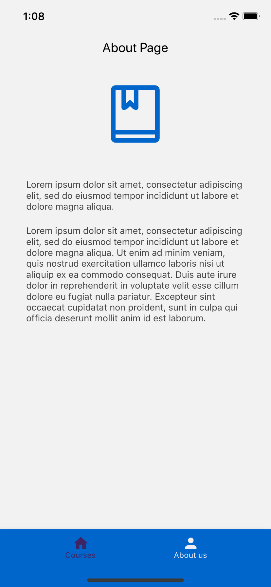

# CS571 Workshop 02
## MIU Courses Review App
* Complete the code in `App.js` to render an application with the following structure:
  * Material Bottom Tab Navigator
    * Stack Navigator
      * CoursesList screen
      * CourseDetails screen
      * AddReview screen
    * About screen
* Complete the code in `/components/CoursesList.js` to display the Live Search and list of courses using `FlatList`. The `Course` reusable component renders a single course, you will need to implement `infoPressed` method and make it functional.
* Complete the code in `/components/CoursesDetails.js` to display the course details.
* Complete the code in `/components/AddReview.js` to meet the following requirements:
  * Add...
  
## Please find screenshots for the finished application:  

  
  
  
  

